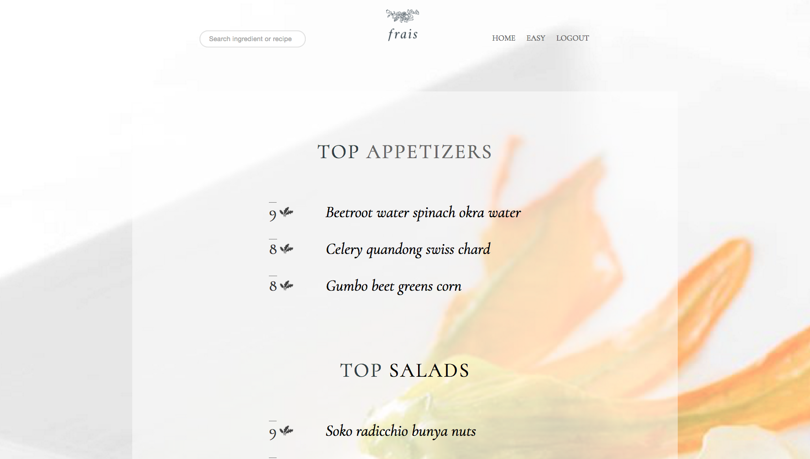
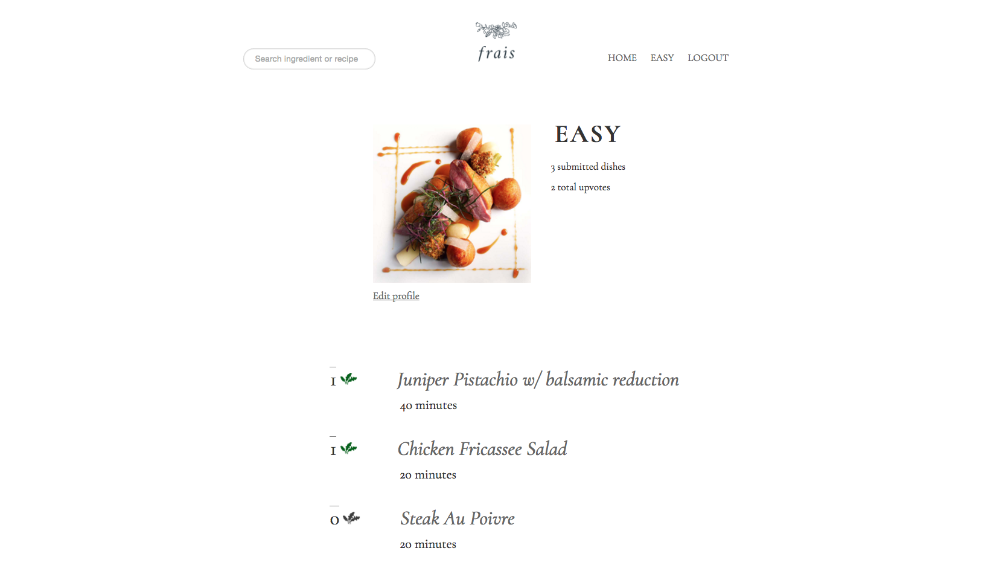
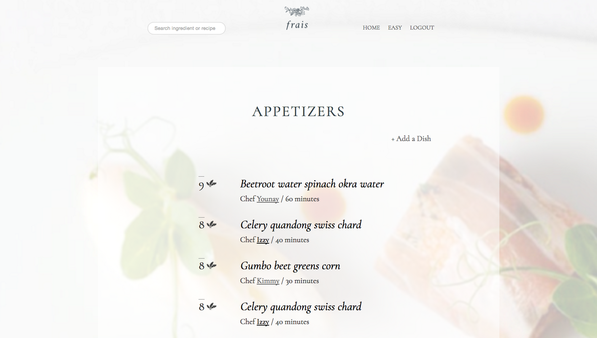
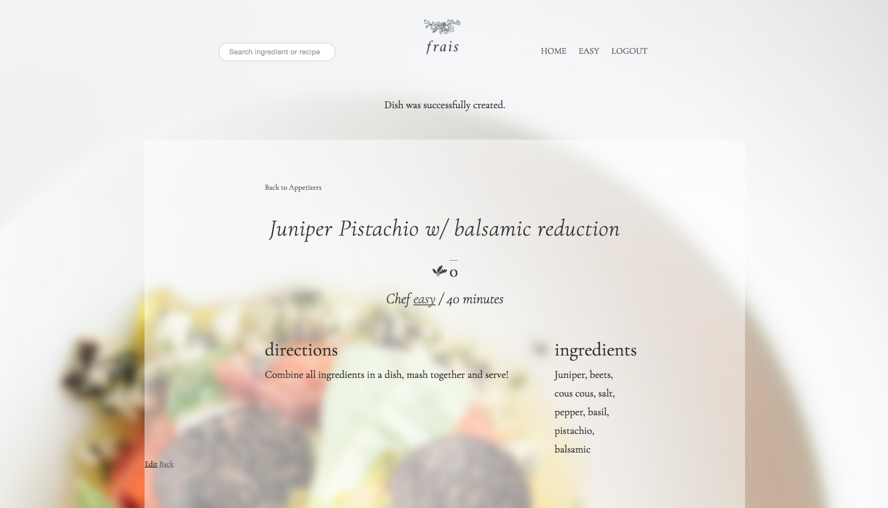

# Frais

Foodies and talented chefs rejoice! This fresh, stylish full-stack Rails application crowdsources recipes from users, who can submit entries to win a place in the opening night menu of local vegetarian restaurant, Frais.  Recipes can be upvoted/downvoted by the community and users can securely authenticate and submit entries for various course categories.  Users can also search throughout the site for recipes by category, recipe name or ingredient.  

 
  

## Getting Started

These instructions will get you a copy of the project up and running on your local machine for development and testing purposes. See deployment for notes on how to deploy the project on a live system.

### Prerequisites

```
ruby 2.3.1
bundler 1.12.5
rails 5.0.0
```

### Installing
From the command terminal, clone the repository to your local directory...
```
$ git clone https://www.gihub.com/everysum1/Frais.git
$ cd Frais
```

Then run bundle command to install all dependencies and run the server.  

```
$ bundle install
$ rails server
```


## Running ALL the tests

```
bundle exec rspec spec
```

## Deployment

```
heroku open
```

## Built With

* [Ruby on Rails](http://api.rubyonrails.org/) -  Framework used
* [Devise](https://github.com/plataformatec/devise) - Authentication solution used
* [PostgreSQL](https://www.postgresql.org/docs/) - Database used

## Authors

* **Israel Matos** - [Github](https://github.com/everysum1)
* **Youna Yang** - [Github](https://github.com/y0una)
* **Hakim Joseph** - [Github](https://github.com/HakimJoseph)
* **Kim Stephenson** - [Github](https://github.com/kimstephenson)

## License

This project is licensed under the MIT License - see the [LICENSE.md](LICENSE.md) file for details

## Acknowledgments

Thank you for all your help!!
* Ken Rettberg
* Jenny Engard
